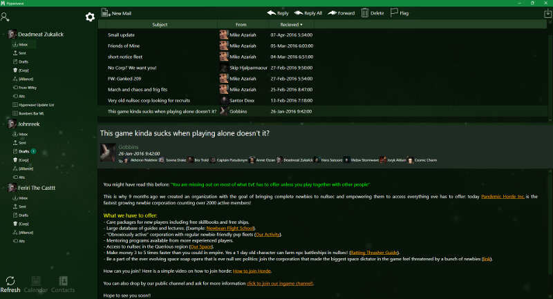
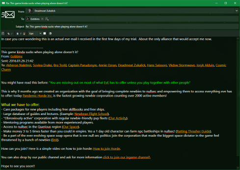

# Hyperwave Eve-Mail Client
### Latest Version
##### [Hyperwave Eve-Mail Client Version 1.0.0](https://github.com/SCDrifter/Hyperwave/releases/download/v1.0.0/Hyperwave-1.0.0.exe)
**Notes:**
 - Initial Release

### Description
[](Doc/MailView.png)
[](Doc/MailReply.png)

This is a Eve-Mail Client for the Game [Eve Online](https://www.eveonline.com/). Eve-Mail is a communication system in game that is similar to E-Mail.

### Features
 - Read & write Eve-Mails for multiple characters
 - Manages Eve-Mail filters and read states
 - Displays Fully Formatted Eve-Mails
 - Supports Mailing lists
 - Background mail checking with notifications(Optional)
 - WYSIWYG Eve-Mail Writer
 - Full Undo/Redo stack for writing Eve-Mails
 - Spell Checker
 - You can place a link on your website that will open a new eve-mail draft straight from your browser
### Planned Features
 - Manage your contacts
 - Get notifications for calendar events
 - Manage calendar events
### Requirements
 - Windows 10 64bit
 - [.Net Framework 4.7.2 Runtime](https://dotnet.microsoft.com/download/dotnet-framework/thank-you/net472-web-installer)
 - Minimum 1 eve account with character
 - A computer with all the cords
 - Electricity
 - A Pulse
### Known Issues

**Mailing lists that your are not currently subscribed to Will Appear as 'Unknown Mailinglist'**
CCP's ESI currently does not provided a way to retrieve the names of Mailinglists that you are not subscribed too.

**The names in the eve client does not match those in hyperwave**
Hyperwave saves all names of characters and corporations and such in a local database to reduce load on CCP servers. But on the rare occasion CCP changes a name, that means that Hyperwave will show the old name. You can reset the local cache by running the following command:
```

%localappdata%\Programs\Zukalitech\Hyperwave\Hyperwave.Util.exe cache clear -acu

```

**Currently Does not support CSPA charges**
Sending mails to someone with CSPA enabled will currently fail. This will be fixed in a futrue update

**Almost no tooltips on any buttons**
Whoops!! The button on the upper left corner adds accounts. The gear button pops up a menu with more options & settings, the rest should be labelled or easy to figure out.

### Web Integration 
You can place a link on your website that will open a new eve-mail draft straight from your browser similar to how mailto links work. You can do this using either Character ID or Chacater name.

**By Id**
[eve-mail://character/96181148](eve-mail://character/96181148)

**By Name**
[eve-mail://character/Deadmeat/Zukalick](eve-mail://character/Deadmeat/Zukalick)

*Note these links won't work if Hyperwave is not installed. Also a security dialog will appear to confirm the action*